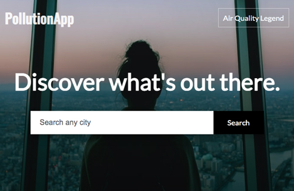

  <h1 align="center">
    PollutionApp
  </h1>
  <h3 align="center">
      
    <br>
  </h3>

## The Project

PollutionApp is a web app that allows all users to monitor the pollution level of their city with geolocation or through the input field you can search for a city and obtain information on air quality.<br>
<br>
The app is divided into two sections, the first with geolocation.getCurrentPosition () geolocates the user by showing the pop up to allow activation.
Latitude and longitude are shown with the getGeo () function.<br>
<br>
The second section was developed to allow the user to search for a city. The search function searchName () generates the coordinates of the city entered and shows the relative pollution levels. The AQI indexes are integrated through the JSON API provided by the AQICN site.<br>
<br>
If a searched city is not available with the searchAqi.status an error code is shown.
<br>
The map uses the Leaflet JS library.
<br>
The .env file is used to set the API key in an environment variable.


## Built With

* ```HTML```
* ```CSS```
* ```JAVASCRIPT```
* ```.ENV```
